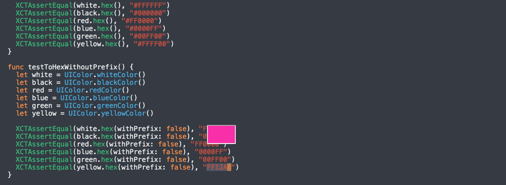

XcodeColorSense
==
An Xcode plugin that makes working with color easier. Inspired by [ColorSense-for-Xcode](https://github.com/omz/ColorSense-for-Xcode) with extra care for Hex color

Features
==

Licence
--
This project is released under the MIT license. See LICENSE.md.
