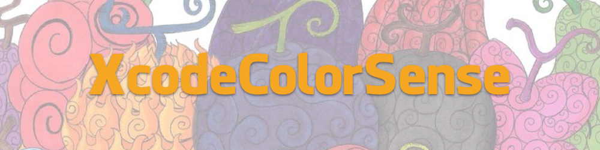
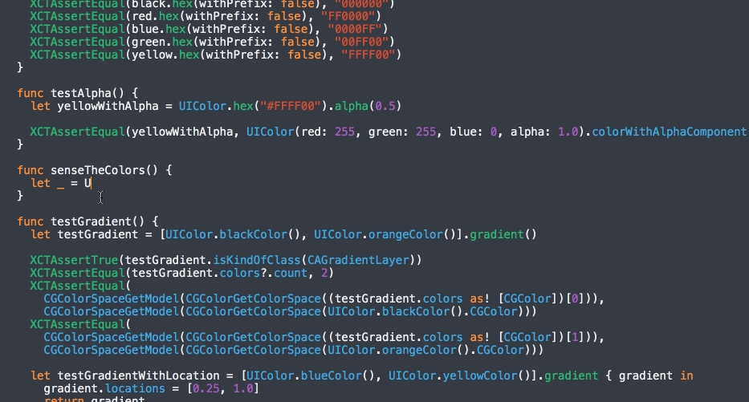

XcodeColorSense
==
An Xcode plugin that makes working with color easier. Inspired by [ColorSense-for-Xcode](https://github.com/omz/ColorSense-for-Xcode) with extra care for Hex color



Features
==

- Show color preview as you type or select
- Works for `UIColor`, `NSColor`



## Matchers

- Hex Matcher

```swift
let _ = NSColor.hex("#FFAABB")
let _ = UIColor(hex: 0xFFAABB)
```

- RGBA Matcher

```swift
let _ = UIColor(red: 1.0f, green: 240/255, blue: 0.8, alpha: 0.95)
```

- Preset Matcher

```swift
let _ = NSColor.redColor()
```

## Extensible

Add your own color handler by conforming to `Matcher`

```swift
protocol Matcher {
  func check(line: String, selectedText: String) -> (color: NSColor, range: NSRange)?
}
```

## Installation

### Manually

- Build the project. The plugin will be in `~/Library/Application Support/Developer/Shared/Xcode/Plug-ins`
- Restart Xcode

### Alcatraz

- Available via http://alcatraz.io/

Licence
--
This project is released under the MIT license. See LICENSE.md.
